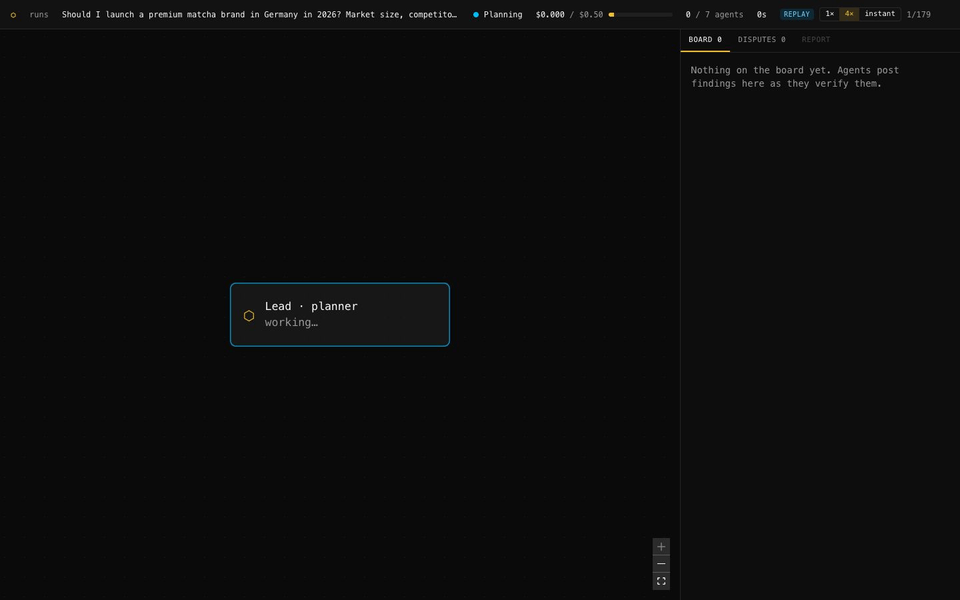
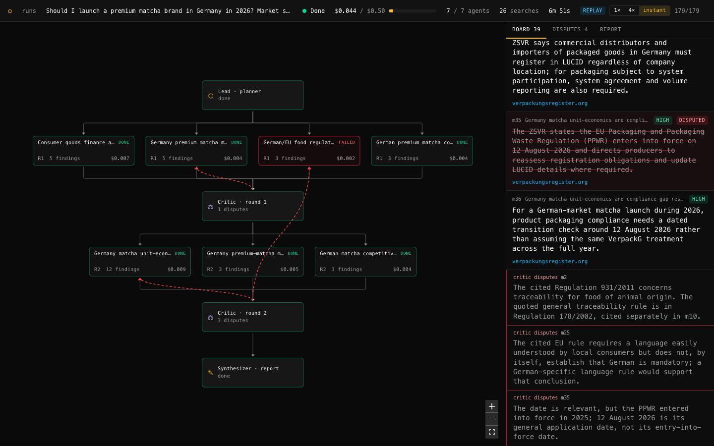
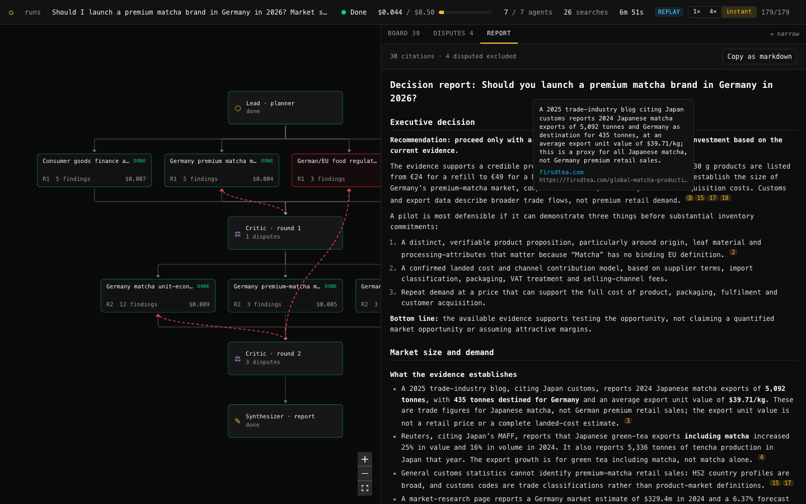
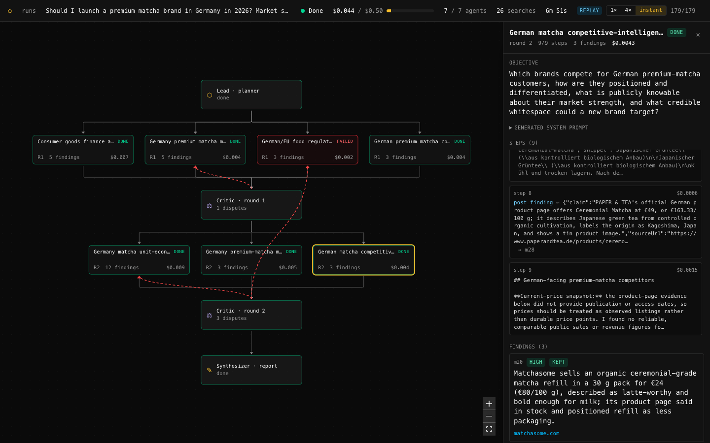
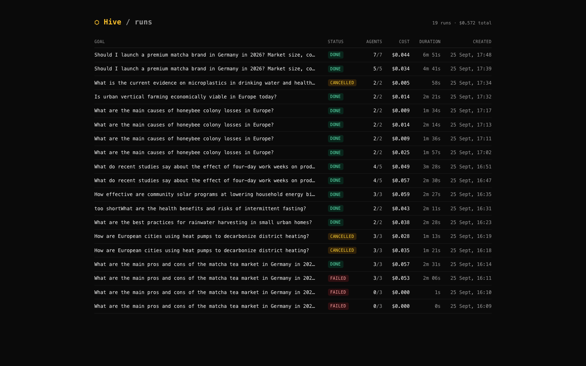
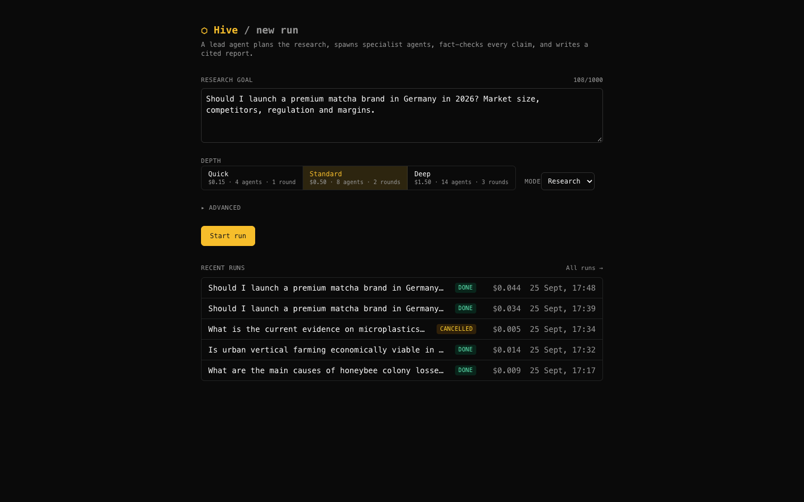
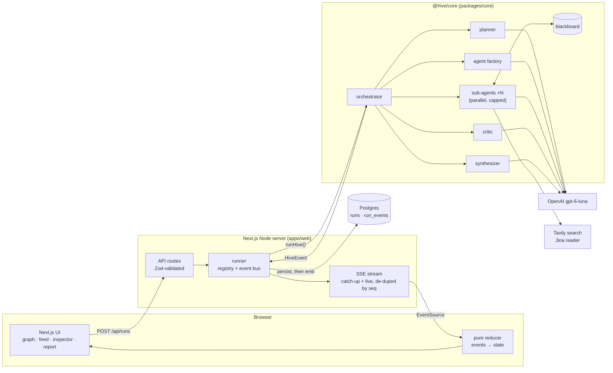

# 🐝 Hive: multi-agent research orchestrator

Give it a goal. A lead agent plans the research, designs specialist sub-agents at runtime,
runs them in parallel on a shared board, fact-checks every claim with a critic, fills gaps
in further rounds, and writes a cited report. You watch it all happen live.



*A real 2-round run replayed at 4×: 7 agents, 26 web searches, 30 citations, 4 disputed claims kept out of the report, $0.044 of model spend.*

## Run it in 3 commands

You need Node 22+, pnpm 10, Docker, an [OpenAI API key](https://platform.openai.com/api-keys)
and a [Tavily API key](https://app.tavily.com) (web search).

```bash
pnpm install && cp .env.example .env    # then put OPENAI_API_KEY and TAVILY_API_KEY in .env
docker compose up -d --wait && pnpm --filter web db:migrate
pnpm dev                                 # open http://localhost:3000
```

`pnpm dev` builds the engine, then runs it in watch mode next to `next dev`.

Prefer a terminal? Run the engine alone (no database needed):

```bash
pnpm --filter @hive/core build && pnpm --filter @hive/core hive "Should I launch a matcha brand in Germany?"
```

## What you get

| Live agent graph | Cited report |
|---|---|
|  |  |
| **Agent inspector** | **Run history and replay** |
|  |  |

- **Live graph:** agents appear as they spawn. A pulsing border means researching, green means done, red means failed and amber means stopped. Dashed red edges show which agent's claim a critic disputed.
- **Inspector:** click any agent to see its objective, the system prompt the factory wrote for it, every tool call with inputs and results (streaming live), its findings, and its cost.
- **Report:** markdown with `[n]` citations. Hover one to see the claim and source, click it to open the source. Disputed claims are listed separately, never cited.
- **Replay:** every run is stored as an event log, so any past run replays in the same UI at 1×, 4× or instantly. Refreshing mid-run restores the full state and keeps streaming.
- **Controls:** set the budget, number of agents and number of rounds with presets or exact values. Cancel stops the agents within a second and still writes a report from what was found.



## How it works



1. **Plan:** the lead model splits the goal into 2–6 independent sub-questions.
2. **Design agents:** the factory writes a focused system prompt and step budget for each specialist.
3. **Research:** agents run in parallel (3 at a time by default) with `web_search`, `read_page`, `read_board` and `post_finding`. Web pages are fenced as untrusted data. Right after new sources arrive, an agent must post findings from them.
4. **Critique:** a skeptical critic checks each finding's evidence against its claim, disputes weak ones, and names up to 3 gaps. Gaps become the next round's agents.
5. **Synthesize:** the report uses only undisputed findings. Every `[n]` is checked against a real finding, and invented numbers are removed.

The engine never touches the web app. It only emits typed `HiveEvent`s. The web layer gives each one a gapless `seq`, stores it in Postgres, and only then streams it to browsers. Live view, reconnects and replays all go through the same pure reducer, which ignores unknown events and never throws.

Details: [docs/PRD.md](docs/PRD.md) (what), [docs/ARCHITECTURE.md](docs/ARCHITECTURE.md) (how, including the event protocol), [docs/TASKS.md](docs/TASKS.md) (build order).

## Cost and limits

Defaults are tuned to stay cheap and under a basic OpenAI rate limit:

| Guard | Default | Change with |
|---|---|---|
| Model (lead and workers) | `gpt-6-luna` ($0.10 / $0.50 per 1M tokens) | `HIVE_LEAD_MODEL`, `HIVE_WORKER_MODEL` (update `PRICES` in `packages/core/src/config.ts`) |
| Dollar budget per run | $0.15 / $0.50 / $1.50 presets, max $2.00 | the form |
| Agents running at once | 3 | `HIVE_MAX_CONCURRENCY` |
| Web searches per agent | 4 (run capped at agents × 4; repeated queries are free) | `HIVE_MAX_SEARCHES_PER_AGENT` |
| Per-agent timeout | 120 s, 5 retries with backoff on rate limits | `packages/core/src/agent.ts` |

A typical 2-agent run costs about $0.01–0.02 and uses about 8 Tavily credits. The 7-agent demo above cost $0.044 and used 26 credits.

## Configuration

Everything lives in the root `.env` (see [`.env.example`](.env.example)):

| Variable | Required | Purpose |
|---|---|---|
| `OPENAI_API_KEY` | yes | model calls |
| `TAVILY_API_KEY` | yes | web search |
| `DATABASE_URL` | yes | defaults to the docker-compose Postgres |
| `JINA_API_KEY` | no | higher rate limits for page reading |
| `HIVE_BASIC_AUTH` | no | `user:pass` puts every page and API behind basic auth |
| `HIVE_LEAD_MODEL`, `HIVE_WORKER_MODEL`, `HIVE_MAX_CONCURRENCY`, `HIVE_MAX_SEARCHES_PER_AGENT` | no | see above |

> **Before exposing Hive beyond localhost,** set `HIVE_BASIC_AUTH`. Without it, anyone who can reach the
> server can start runs on your API keys. See [Deploy](#deploy-railway) for hosting.

## Deploy (Railway)

Hive needs **one long-running Node server plus Postgres**. Runs execute for minutes inside the server
process and stream to the browser from that same process, so serverless platforms (e.g. Vercel functions)
don't fit. [Railway](https://railway.com) runs both from this repo:

1. **New project → Deploy from GitHub repo →** pick this repo. `railway.json` sets the build (`pnpm build`),
   start (`pnpm start`, which applies database migrations first), a `/api/health` check, and 1 replica.
2. **+ New → Database → PostgreSQL** in the same project.
3. On the app service, **Variables:**
   - `DATABASE_URL` = `${{Postgres.DATABASE_URL}}` (a reference to the database you just added)
   - `OPENAI_API_KEY`, `TAVILY_API_KEY`
   - `HIVE_BASIC_AUTH` = `user:a-long-password` (**required on a public URL**, or anyone can spend your keys)
4. **Settings → Networking → Generate Domain.** Open it, log in with the basic-auth user, start a run.

Keep it at one replica: the live event stream lives in the server's memory. Redeploys mark in-flight runs
as *Interrupted*; their events up to that point still replay.

## Development

```bash
pnpm typecheck        # both packages
pnpm test             # Vitest: engine on a mock model (no API keys), reducer, SSE, graph, auth
pnpm build
pnpm --filter web db:generate   # after changing apps/web/lib/db/schema.ts
```

```
hive/
├── packages/core/        # the engine (@hive/core): orchestrator, agents, critic, synthesizer, tools
│   └── test/             # full runs on the AI SDK mock model
├── apps/web/             # Next.js App Router UI + API
│   ├── app/              # pages and /api/runs routes (create, list, cancel, SSE, events.json)
│   ├── components/       # graph/, feed/, inspector/, report/, status-bar/, history/
│   ├── lib/              # runner, run-state reducer, graph builder, db (Drizzle), basic auth
│   └── test/fixtures/    # recorded real runs used by tests
├── docs/                 # PRD, architecture, tasks, README assets
└── docker-compose.yml    # Postgres 16 (localhost only)
```

## Roadmap

- [x] Engine: planner, agent factory, parallel agents, shared board, critic loop, budget, CLI
- [x] Web UI: live agent graph, inspector, cited report, replay, cancel, run history
- [ ] Durable runs (Inngest) and a Redis-backed board, so runs survive restarts and scale out
- [ ] Claim de-duplication with pgvector, and tracing with Langfuse
- [ ] Agents answering each other's `question` messages
- [ ] Agent builder with saved templates, and a debate mode
- [ ] Evals: citation faithfulness, single-agent vs multi-agent quality and cost
- [ ] Public deployment with a shareable replay link
